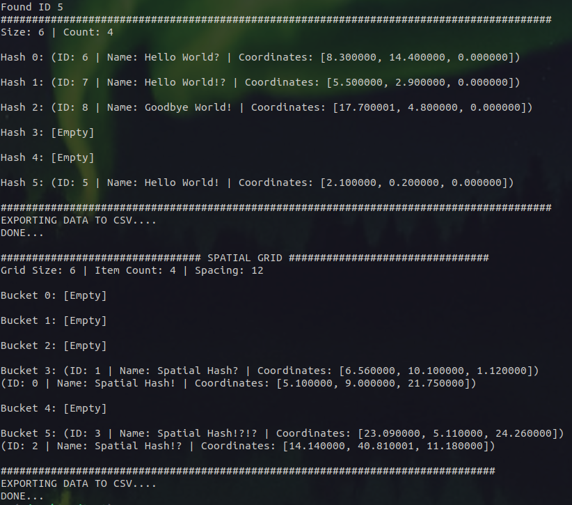
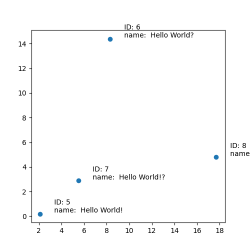
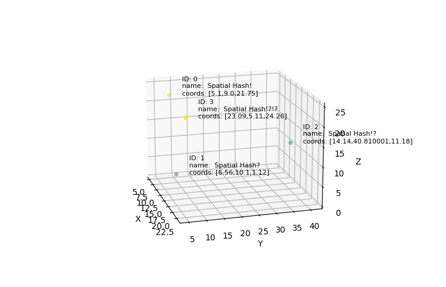
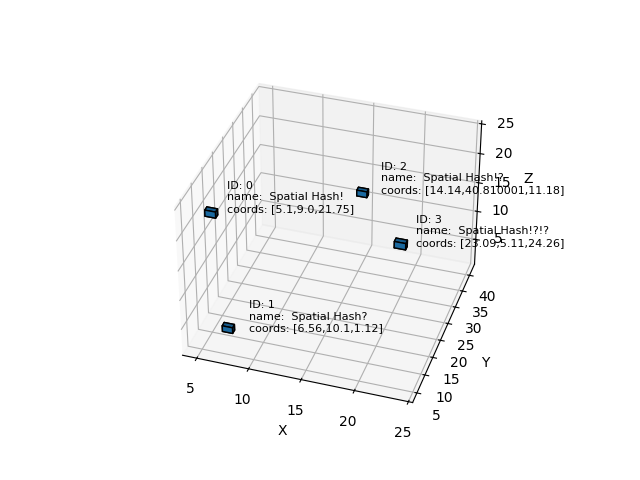

## Learning Journey: Hash and Spatial Hashing

### Overview
I originally wanted to make something modular, meaning a data structure that's able to switch between the many available data structures in real-time. However, I realized the scope of my project would perhaps be far too complex and so I narrowed my focus to something specific, starting with: **data ⮕ linked list ⮕ hash table and spatial hash** (more will be explained in later sections).


### Resources
* [Ten Minute Physics](https://matthias-research.github.io/pages/tenMinutePhysics/index.html)
* [How to Create Spatial Hash Maps for XPBD Self Collisions](https://carmencincotti.com/2022-10-31/spatial-hash-maps-part-one/#how-to-hash-a-position)
* [Hash Table Data Structure](https://www.geeksforgeeks.org/hash-table-data-structure/)
* [How To Implement a Sample Hash Table in C/C++
](https://www.digitalocean.com/community/tutorials/hash-table-in-c-plus-plus)
* C and Python ([numpy](https://numpy.org/) and [matplotlib](https://matplotlib.org/))

### In Detail
The project is structured as follows:

In ```./src``` directory:
* Data (can be modified/changed based on specific needs)
    * [data.h](./src/include/data.h)
    * [data.c](./src/data.c)
* Node:
    * [node.h](./src/include/node.h)
    * [node.c](./src/node.c)

* Hash (includes spatial hashing functions):
    * [hash.h](./src/include/hash.h)
    * [hash.c](./src/hash.c)

Each implementation depends on each other:
```c
//   data.h     //          //   node.h       //              //             hash.h                 // 
//    Data     //           //   Linked List  //             //   Hash Table        Spatial Hash   //
typedef struct              typedef struct                   typedef struct         typedef struct
{                           {                                {                      {
    int ID;        ------>      Data *data;         ------>      Node **buckets;        Node **buckets;
    char name[50];              struct Node *next;               int size;              int size;
    float coords[3];        } Node;                              int count;             int count;
} Data;                                                      } Hash_Table;              int x;
                                                                                        int y; 
                                                                                        int z;
                                                                                    } Grid;
```

There are two driver files: **[main.c](./main.c)** and **[py_main.py](./py_main.py)**.

[main.c](./main.c) initializes the the data structure with sample data and exports it to two **CSV** files depending on which is used: *hash_data.csv* and *spatial_data.csv*. 

This is the output for hash and spatial hash: 



[py_main.py](./py_main.py) reads the **CSV** files generated and proceeds to plot them. There are three functions to plot from:     *"plot_hash_data()"*, *"plot_spatial_hash()"*, and *"plot_spatial_voxel()"*. They plot based on data structure and how they being viewed.

Outputs from the following functions:

**plot_hash_data():**


**plot_spatial_hash():**


**plot_spatial_hash():**



To avoid running both drivers, a shell script called [startup.sh](./startup.sh) manages the Makefile and python environment automatically.

### Final Thoughts
Having separated data structures, perhaps reusing and modifying theses modules can perhaps help for future projects...